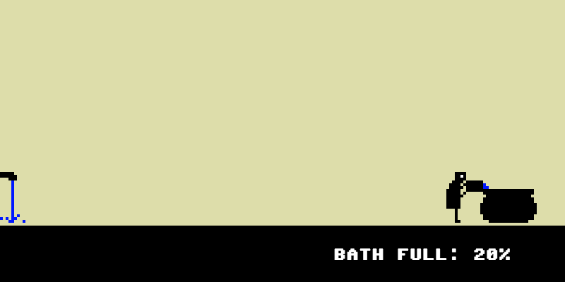
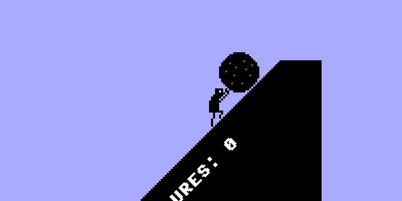
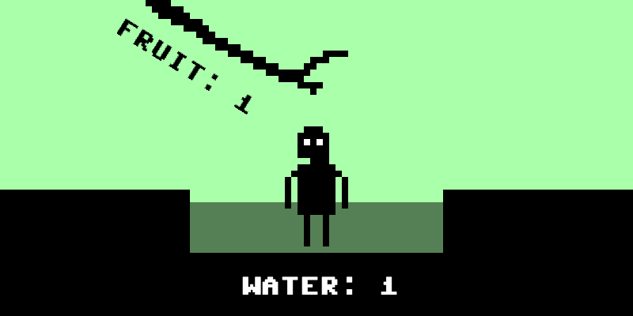
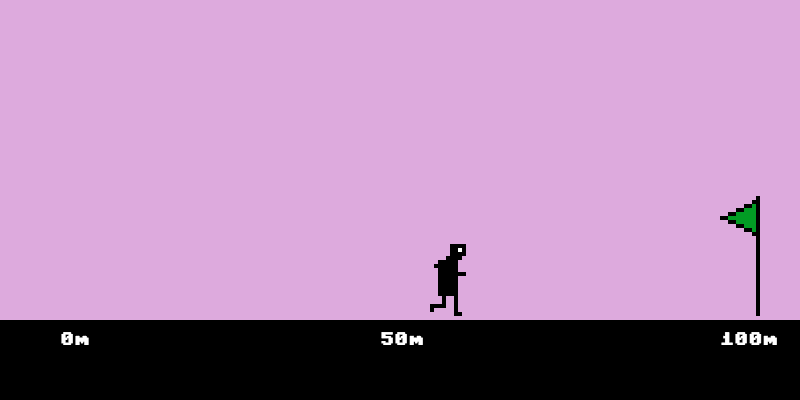

# *Let's Play: Ancient Greek Punishment: Limited Edition*

## Information
* Released: 21 June, 2016
* Website: http://www.pippinbarr.com/
* Platforms: Browser
* Link: http://www.pippinbarr.com/lets-play-ancient-greek-punishment-limited-edition/info
* Price: Free.

## Description
It's Greek punishment! Again! Push a rock up a hill! Again! Try to drink the water! Again! Struggle against your chains! Again! It's all the same! But everything is different!

## History
Let's Play: Ancient Greek Punishment: Limited Edition! is the second follow-up to the original Let's Play: Ancient Greek Punishment. In this case I was interested in the idea of actually succeeding at each of the assigned tasks, because it seemed like an opportunity to explore a different kind of terrifying eternity: one in which you have nothing to do at all. Camus wrote about the idea of Sisyphus being happy pushing the boulder up the hill because, in essence, it gave him a way to pass the time, a kind of "good honest toil". It would follow that if Sisyphus succeeded, and the boulder went away, he'd be in a deeper hell than previously.

This also ties in with the videogame as a medium for this larger project on the myths. The first version was chiefly about subverting the player's usual expectation of efficacy and ultimate victory by presenting them with tasks that could never be completed, no matter how they tried. In this version, the tables are turned – the myths are turned into videogames "properly", their "impossible" tasks built from the beginning to be defeated by the player as is the case with most conventional game design. In this case, though, the idea is to emphasise that in a sense success is the worst punishment of all. When you win, you have nothing left to live for. To quote Hans Gruber in Die Hard claiming to quote Plutarch: "when Alexander saw the breadth of his domain, he wept for there were no more worlds to conquer."

## Features
* A boulder.
* Edible fruit.
* Weak links.
* A fillable bath.
* A runnable race.

## Images

## Trailer
[View the trailer on YouTube](https://youtube.com/watch?v=YIOh9D3IvMM)

## Credits
* Pippin Barr: Everything
